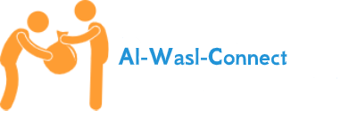
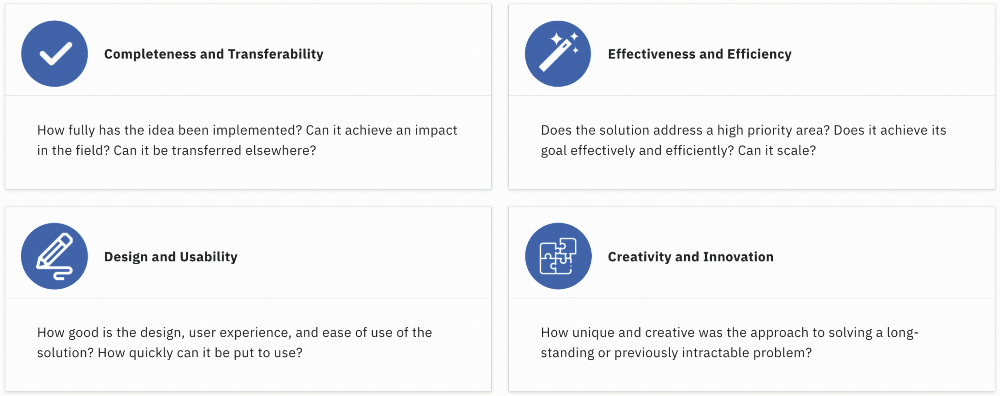
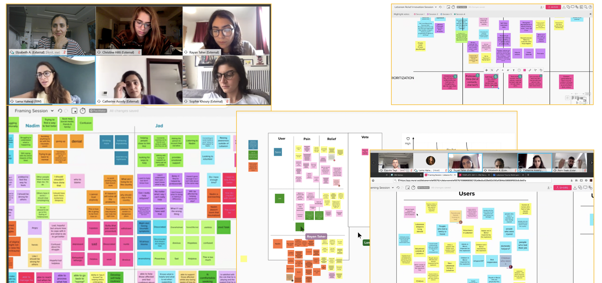
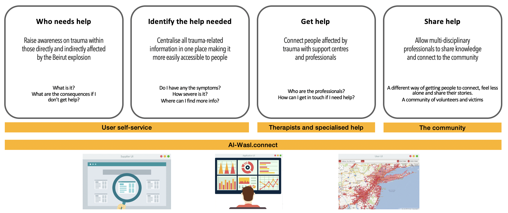
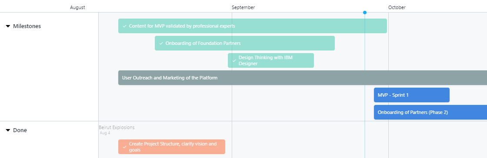
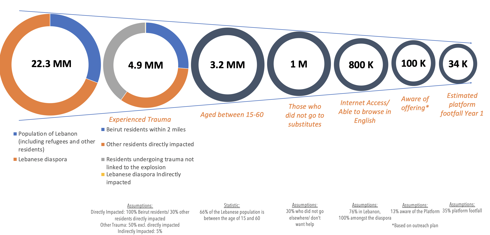
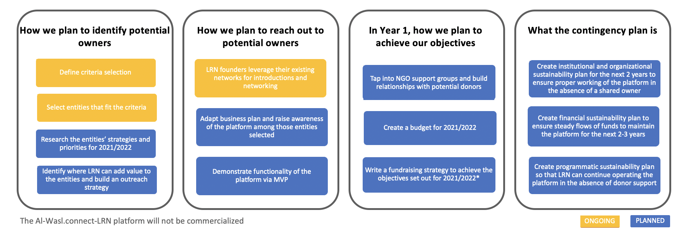
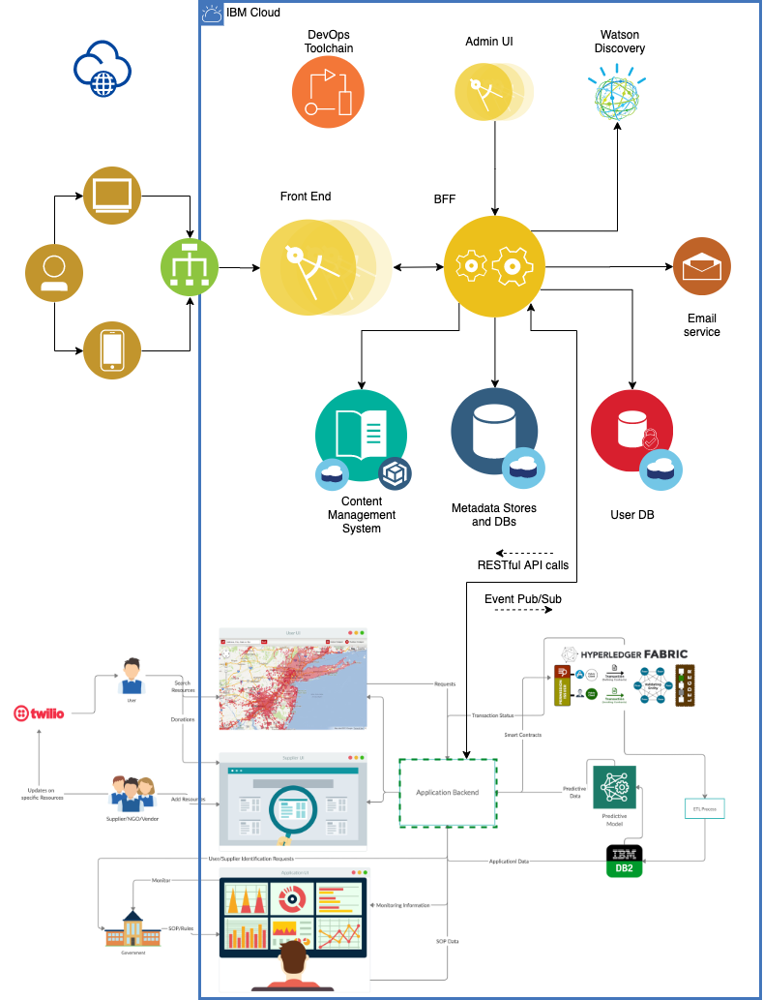

# Lebanon Relief Network

## Contents

1. [Team](#the-team)
1. [Al-Wasl.connect Lebanon Relief Network](#al-waslconnect-lebanon-relief-network)
1. [Solution](#solution)
1. [Architecture](#solution-architecture)
1. [Version](#version)

## The Team
We are a group Lebanese expats and international volunteers, working in different fields, but united by a cause: helping Lebanon.
- [Elizabeth Asseily](https://www.linkedin.com/in/elizabeth-asseily-3304ba20) - Team Lead
- [Christine Hitti](https://www.linkedin.com/in/christine-hitti-mdem-666a766a) - Crisis Management Specialist
- [Rayan Taher](https://www.linkedin.com/in/rayan-taher-mbpss-5b4884150) - Mental Health Specialist
- [Catherine Asseily](https://www.linkedin.com/in/catherine-asseily-313b2132/) - Marketing Specialist
- [Rami Saab](https://www.linkedin.com/in/rami-roberto-saab-2b32a3b3/) - Content Editor
- [Sophie Khoury](https://www.linkedin.com/in/sophiekhoury/) - Creative Strategist
- [Steve Arnold](https://www.linkedin.com/in/sarnoldatwork/) - Development Lead
- [Brian Say](https://www.linkedin.com/in/brian-say/) - Scrum Master
- [Claudio Tag](https://www.linkedin.com/in/claudiotagliabue) - IT Architect

## Al-Wasl.connect Lebanon Relief Network

A traumatic event like the Beirut explosion of August, 4th is bound to have repercussions on the mental health of those directly and indirectly affected. UNICEF estimates that 600,000 children could be in need of psychosocial support.

The mission of the Lebanon Relief Network is to raise awareness and connect individuals affected by trauma with mental health support networks, independently of religious views and political affiliations.

Lebanon Relief Network - built on Al-Wasl.connect will:
- Connect individuals suffering from trauma - inside and outside Lebanon - with local and international trauma relief organizations, independent professionals, and volunteers.
- Raise awareness and create a forum for professionals working in the field of psychotrauma to share ideas and knowledge relevant to their work in the field.

### How can Al-Wasl.connect-LRN platform help?

The Lebanon Relief Network is an extension to the Al-Wasl.connnect platform, focussing on help requests and offers related to trauma, and effects of trauma on mental health.

The platform will address:
- Lebanese citizens that were affected by the explosion on August, 4th, 2020
- Individuals outside of Lebanon that were affected by the event (Lebanese diaspora)
- Associations, organizations, NGOs, academic institutions and experts with specific psychotrauma experience
- International Volunteers

#### Completeness and Transferability
The LRN extension aims to ingest requests coming from Al-Wasl.connect when they are directly related to trauma and mental health:
- providing access to self-help
- putting victims of trauma in touch with therapists and volunteering organisations
- functioning as a content aggregator for the disparate initiatives around trauma and mental health in Lebanon

Although the platform is focussed on Lebanon, psychotrauma is an unavoidable consequence of disasters and calamities. A relief platform capable of addressing the effects of trauma on mental health and connecting experts from around the world could contribute substantially to advancing collaboration in the field of trauma, and also have a significant impact in the field outside of Lebanon.
#### Effectiveness and Efficiency
LRN extends Al-Wasl.connect, narrowing its focus on trauma and mental health. The centered aim of Al-Wasl.connect-LRN is to prevent serious mental health consequences from emerging as a result of the traumatic events taking place in Lebanon, and to do so effectively and at scale.
#### Design Usability
A Design Thinking Workshop run across London and Dubai, with experts in psychotrauma, mental health, crisis management, marketing, product rollouts, and user experience laid the foundations of a usable and user-first platform. Based on the design and user stories, the first development sprint will produce an MVP by October 11th, 2020.

#### Creativity and innovation
The immediate efforts of NGOs and volunteering communities focusing on tackling the short-term aftermath of the explosion. However, repercussions of trauma on those affected by the explosion can lead to serious mental health consequences months and years down the line. In a region where trauma and mental health are still clouded by stigma, Al-Wasl.connect-LRN will complement the psycho-social support on the ground by raising awareness on a large scale, and by aggregating and providing access to available support and offers of help.

## Solution
Al-Wasl.connect - Lebanon Relief Network is a web-based platform built as an extension to Al-Wasl.connect, which will allow victims of trauma to seek help anonymously, whilst connecting them with professional organizations and volunteers offering mental health support.

### Project Roadmap
#### Design and Development
The Project is adopting Design Thinking and Agile Development methodologies:
- A Design Thinking Workshop has been completed in September 2020
- Sprint 1 of the Minimum Viable Product development is currently in progress

#### User Footfall
An estimation of the user footfall has been created, assuming that the MVP will be in English only.

#### Sustainability Plan
LRN founders are dedicated to their mission of raising awareness and connecting individuals affected by trauma with mental health support networks.
After the initial development and hosting provided by IBM and IBM Corporate Social Responsibility, we plan to offer part ownership of the platform to organizations whose missions complement that of LRN. In parallel, we will be working on a contingency plan to fully sustain the platform until such partnership(s) are concluded.

### Video and Overview
An overview of the submission and the solution is available below:
- [Presentation](https://ibm.box.com/s/oeil9na69kxs9wji6ge7x10g08f8cza8)
- [Video](https://ibm.box.com/s/katnc9vmwa3h8umbw91xc3jzr8b13dqi)

## Solution Architecture
The solution is a web-based platform.
- The front and back ends are coded primarily in Node.JS
- Data and metadata stores use Cloudant
- Content is stored in Object Storage
- Connectivity to Al.Wasl-connect is achieved via RESTful invocations
- [Future] Al.Wasl-connect emits events (e.g. via Kafka) which the LRN module can subscribe to
- Watson Discovery is used for content analys is
- Personal and Sensitive Information is encrypted at rest
- Email notifications and calendar invites are sent via SMTP

### IBM Cloud Services
* [IBM Cloud Foundry](https://cloud.ibm.com/cloudfoundry/overview)
* [IBM Toolchain](https://cloud.ibm.com/devops/create)
* [IBM Cloudant](https://cloud.ibm.com/catalog/services/cloudant)
* [IBM Cloud Object Storage](https://cloud.ibm.com/catalog/services/cloud-object-storage)
* [Watson Discovery](https://cloud.ibm.com/catalog/services/discovery)
* [Key Protect](https://cloud.ibm.com/catalog/services/key-protect)
* [Sendgrid](https://cloud.ibm.com/catalog/infrastructure/email-delivery)

### Code
The MVP code is publicly available on GitHub:
<a href="https://github.com/briansay/project-lebanon" target="_blank">https://github.com/briansay/project-lebanon</a>

## Version
v0.1
