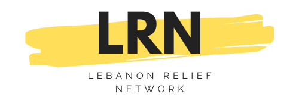
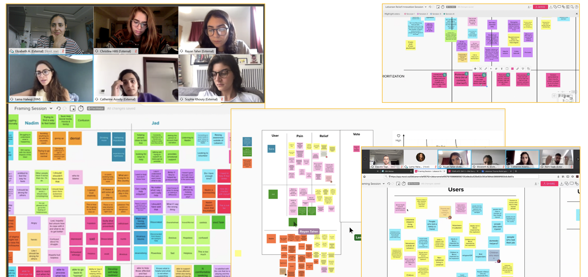
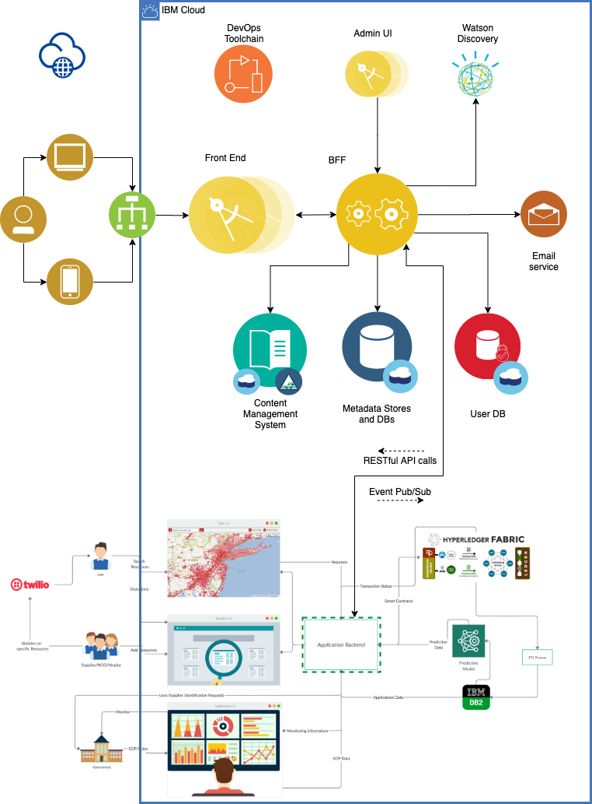

# Lebanon Relief Network

## Contents

1. [Submission](#submission)
1. [Solution](#solution)
1. [Architecture](#solution-architecture)
1. [Built with](#built-with)
1. [Version](#version)

## Submission

### The LRN team
We are a group Lebanese expats and international volunteers, working in different fields, but united by a cause: helping Lebanon.
- [Elizabeth Asseily](https://www.linkedin.com/in/elizabeth-asseily-3304ba20), Team Lead
- [Christine Hitti](https://www.linkedin.com/in/christine-hitti-mdem-666a766a), Crisis Management Specialist
- [Rayan Taher](https://www.linkedin.com/in/rayan-taher-mbpss-5b4884150), Mental Health Specialist
- [Catherine Asseily](https://www.linkedin.com/in/catherine-asseily-313b2132/), Marketing Specialist
- [Rami Saab](https://www.linkedin.com/in/rami-roberto-saab-2b32a3b3/), Content Editor
- [Sophie Khoury](https://www.linkedin.com/in/sophiekhoury/), Creative Strategist
- [Stve Arnold](https://www.linkedin.com/in/sarnoldatwork/), Development Lead
- [Brian Say](https://www.linkedin.com/in/brian-say/), Scrum Master
- [Claduio Tag](https://www.linkedin.com/in/claudiotagliabue), IT Architect

### Lebanon Relief Network - An Al-Wasl.connect extension

A traumatic event like the Beirut explosion of August, 4th is bound to have repercussions on the mental health of those directly and indirectly affected. UNICEF estimates that 600,000 children could be in need of psychosocial support.

The mission of the Lebanon Relief Network is to raise awareness and connect individuals affected by trauma with mental health support networks, independently of religious views and political affiliations.

Lebanon Relief Network - built on Al-Wasl.connect will:
- Connect individuals suffering from trauma - inside and outside Lebanon - with local and international trauma relief organizations, independent professionals, and volunteers.
- Raise awareness and create a forum for professionals working in the field of psychotrauma to share ideas and knowledge relevant to their work in the field.

### How can Al-Wasl.connect-LRN platform help?

The Lebanon Relief Network is an extension to the Al-Wasl.connnect platform, focussing on help requests and offers related to trauma, and effects of trauma on mental health.

The platform will address:
- Lebanese citizens that were affected by the explosion on August, 4th, 2020
- Individuals outside of Lebanon that were affected by the event (Lebanese diaspora)
- Associations, organizations, NGOs, academic institutions and experts with specific psychotrauma experience
- International Volunteers

#### Completeness and Transferability
The LRN extension aims to ingest requests coming from Al-Wasl.connect when they are directly related to trauma and mental health:
- providing access to self-help
- putting victims of trauma in touch with therapists and volunteering organisations
- functioning as a content aggregator for the disparate initiatives around trauma and mental health in Lebanon
Although the platform is focussed on Lebanon, psychotrauma is an unavoidable consecquence of disaters and calamities. A relief platform capable of addressing the effects of trauma on mental health can have huge impacts in the field outside of Lebanon as well.
#### Effectiveness and Efficiency
LRN extends Al-Wasl.connect, narrowing its focus on trauma and mental health. The LRN aim is to target a specific issue related to the aftermath of the August 4th Beirut explosion, but to do so effectively and at scale, to prevent long-term repercussion on mental health of those directly and indirectly affected.
#### Design Usability
A Design Thinking Workshop run across London and Dubai, with experts in psychotrauma, mental health, crisis management, marketing, product rollouts, and user experience laid the foundations of a usable and user-first platform. Based on the design and user stories, the first development sprint will produce an MVP by October 11th, 2020.

#### Creativity and innovation
The immediate efforts of NGOs and volunteering communities focusing on tackling the short-term aftermath of the explosion: from disaster relief to first aid, from food distribution to providing shelter.A traumatic event of this nature is however also bound to have repercussions on the mental health of those directly and indirectly affected. In a region where trauma and mental health are still covered by stigma, Lebanon Relief Network - Al-Wasl.connect will help reach out and help those affected, and provide relief to an issue which, although often overlooked, will have multi-year consequences if untreated.

## Solution
- Platform description + scope

### Roadmap
- Design thinking
- development
- User impact
- Donation to NGOs

### Code
- GitHub repo

### Video
[Here](https://ibm.box.com/s/f0c6ho9ca6p5gw3o1k8u3dp1lfkn7o64)

## Solution Architecture

### IBM Cloud Services
- List of Cloud services used

## Built with
* [IBM Cloud Foundry](https://cloud.ibm.com/cloudfoundry/overview)
* [IBM Toolchain](https://cloud.ibm.com/devops/create)
* [IBM Cloudant](https://cloud.ibm.com/catalog/services/cloudant)
* [Node.js](https://nodejs.org/en/)

## Version

v0.1
